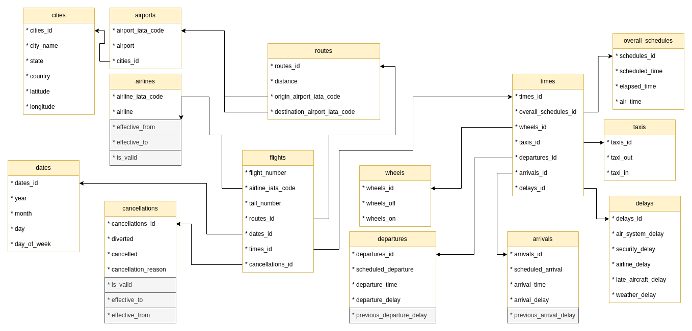
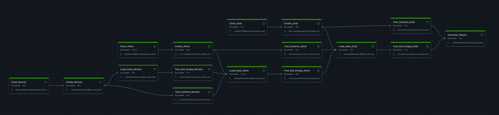

# 🥷 DELAY STALKER 🥷


[](https://pre-commit.com/)
[](https://www.kaggle.com/datasets/usdot/flight-delays/data)


*Big Data doesn’t forget flight delays, and neither does this pipeline.*

## Overview

**Delay Stalker** is an end-to-end Databricks pipeline designed for Big Data enthusiasts, tracking historical flight delays and cancellations with Slowly Changing Dimensions (SCD) support.

This project provides:

* [**Medallion architecture**](https://www.databricks.com/glossary/medallion-architecture): Bronze -> Silver -> Gold layered data pipeline
* Automatic **incremental loading** and change tracking

* **Support for SCD** Type 2 (full history) and Type 3 (previous value tracking)

* **Historical tracking** of flights, focusing on delays and cancellations

* Streamlined **business intelligence reporting** powered by Big Data pipelines

## Table of Contents

* [Architecture](#architecture)
* [Data Source](#data-source)
* [Installation](#installation)
* [Usage](#usage)
* [Testing](#testing)

## Architecture

### Data Structure

The Data Stalker project is built as a fully **modular Databricks pipeline**, following a **snowflake** schema design. This approach reduces data redundancy, ensures data consistency, and optimizes storage efficiency across the warehouse layers. The schema of the data structure is shown in the following ER diagram.



### Medallion Architecture

The architecture is structured around the **Medallion layers**:

* 🥉 **Bronze** – raw ingested data;

* 🥈 **Silver** – cleaned, enriched, and validated datasets;

* 🏆 **Gold** - aggregated, business-ready data for reporting and analytics;

Each layer has dedicated scripts for:

* Data ingestion and transformation

* Schema creation and layer setup

* Cleaning and validation

Additionally, the **gold layer is integrated with script for business report generation**.

### Slowly Changing Dimensions (SCD)

The system supports Slowly Changing Dimensions (SCD), preserving historical changes while maintaining current data for analytics. Each layer builds upon the previous one, maintaining a **clean, traceable, and auditable** pipeline from raw to business-ready datasets.

### Tests and Parallelization

All scripts are **fully tested**, ensuring correctness and reliability. Tasks within Databricks jobs are **highly parallelized** to maximize computation efficiency.



## Data Sources

The system ingests [**historical flight data**](https://www.kaggle.com/datasets/usdot/flight-delays/data) capturing flight schedules, delays, and cancellations. This dataset serves as the backbone for the Bronze -> Silver -> Gold pipeline, allowing realistic scenarios for ETL, SCD processing, and BI reporting.

## Installation

This project is designed for Databricks. To run locally:

``` bash
git clone https://github.com/MajaByr/Delay-Stalker.git
cd Delay-Stalker
./setup.sh
source .venv/bin/activate
```

For full Databricks experience, attach this repo to a Databricks cluster with Delta Lake enabled.

## Usage

1. **Attach the repository to a Databricks cluster** \
   Make sure your cluster has access to the storage location with the Kaggle datasets.
2. **Run the pipeline using stalking-pipeline.yaml**
   ``` bash
   databricks pipelines deploy --file stalking-pipeline.yaml
   databricks pipelines run --name Stalking-Pipeline
   ```
3. **Monitor pipeline progress** \
    Check pipeline logs in the Databricks UI to see ETL stages: Bronze → Silver → Gold

4. **Query the resulting tables**
   ``` python
    from pyspark.sql import SparkSession

    spark = SparkSession.builder.getOrCreate()

    df_flights_silver = spark.table("flights_gold.daily_distances")
    df_flights_silver.show(5)
   ```

## Testing

Testing scripts are integrated into ETL pipeline. All tests are available in `tests/`.

### Tests cover:
* Correctness of each data structure schema;
* Ensuring tables contain data after the `load` step.

---

<p align="center"><i>"Give a person a week, and they’ll get it done in a week. Give them a day, and they’ll finish in a day. Give them an hour, and they’ll complete it in an hour."</i></p>

<p align="center">Project sponsored by cats 🐈 🐈</p>
